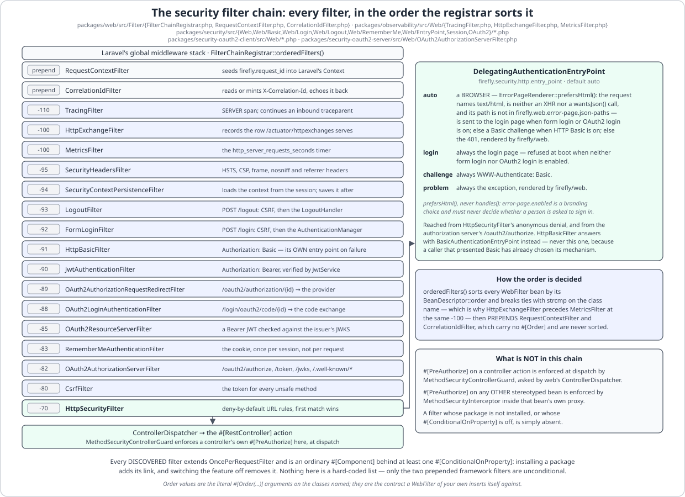
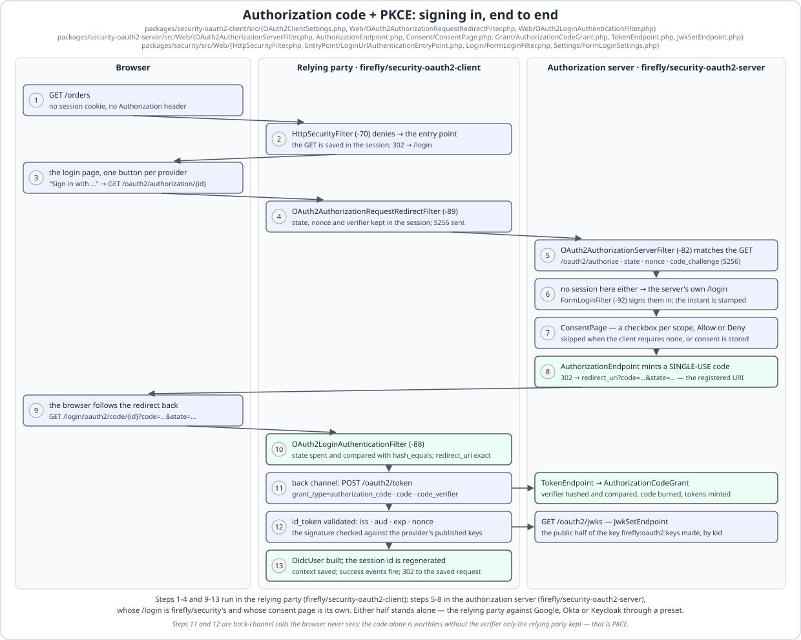
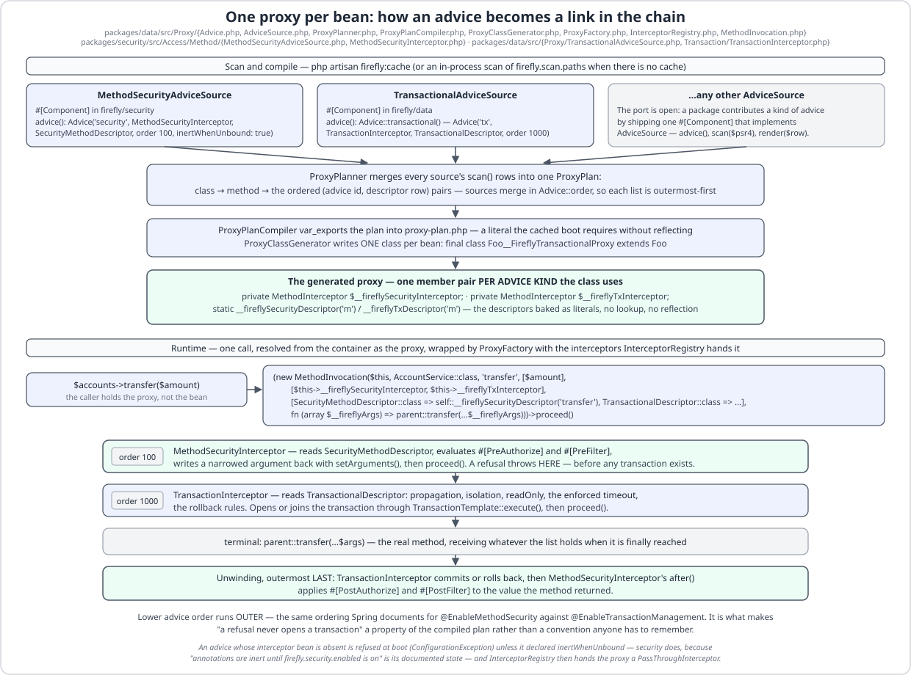

<p align="center">
  
</p>

<h1 align="center">LaraFly</h1>

<p align="center">
  <strong>Spring Boot's cohesion, native to Laravel 13.</strong>
</p>

<p align="center">
  <a href="https://github.com/fireflyframework/fireflyframework-php/actions/workflows/ci.yml"></a>
  <a href="https://github.com/fireflyframework"></a>
  <a href="docs/installation.md#requirements"></a>
  <a href="docs/laravel-comparison.md"></a>
  <a href="LICENSE"></a>
  <a href="CHANGELOG.md"></a>
  <a href="docs/contributing.md#conventions"></a>
  <a href="pint.json"></a>
</p>

<p align="center">
  <em>Dependency injection with stereotypes, conditional auto-configuration, hexagonal ports &amp; adapters,
  CQRS, event-driven architecture with a genuine same-transaction outbox, Spring-Security-shaped method
  security on any bean, both halves of OAuth2, and OpenTelemetry-shaped tracing — wired the moment you
  install a package, with your own beans always winning.</em>
</p>

<p align="center">
  <a href="#-the-book--larafly-by-example"><b>📘 Book</b></a> &nbsp;·&nbsp;
  <a href="#quickstart"><b>Quickstart</b></a> &nbsp;·&nbsp;
  <a href="#why-larafly">Why</a> &nbsp;·&nbsp;
  <a href="#architecture">Architecture</a> &nbsp;·&nbsp;
  <a href="#featured-patterns">Patterns</a> &nbsp;·&nbsp;
  <a href="#modules">Modules</a> &nbsp;·&nbsp;
  <a href="#documentation">Docs</a> &nbsp;·&nbsp;
  <a href="CHANGELOG.md">Changelog</a>
</p>

<details>
<summary><b>Table of contents</b></summary>

- [📘 The Book — *LaraFly by Example*](#-the-book--larafly-by-example)
- [Why LaraFly?](#why-larafly)
- [Quickstart](#quickstart)
- [Philosophy](#philosophy)
- [Architecture](#architecture) — [Boot Pipeline](#the-boot-pipeline) · [DI &amp; Auto-Configuration](#dependency-injection--auto-configuration) · [Request Lifecycle](#request-lifecycle) · [CQRS ⟷ EDA Bridge](#the-cqrs--eda-bridge) · [Same-Tx Outbox](#the-genuine-same-transaction-outbox) · [Security Filter Chain](#the-security-filter-chain) · [Signing in with OAuth2](#signing-in-with-oauth2) · [Interception](#interception-one-proxy-many-advices) · [Trace Context](#trace-context-end-to-end)
- [Featured Patterns](#featured-patterns)
- [Installation](#installation)
- [CLI &amp; Project Scaffolding](#cli--project-scaffolding)
- [Modules](#modules)
- [Documentation](#documentation)
- [Roadmap](#roadmap)
- [Firefly Framework Ecosystem](#firefly-framework-ecosystem)
- [Requirements](#requirements)
- [Contributing](#contributing)
- [License](#license)

</details>

---

## 📘 The Book — *LaraFly by Example*

**LaraFly by Example** is the official, project-driven book for the framework — a PHP sibling to
[*PyFly by Example*](https://github.com/fireflyframework/fireflyframework-pyfly). It builds **Lumen**, the
wallet-and-ledger service in [`samples/lumen/`](samples/lumen/), from an empty directory into a secured,
event-driven, actuator-observed microservice, chapter by chapter — every listing drawn from that real project
(it boots and its tests pass against this framework version, `26.09.2`).

The book is **complete and bilingual (English + Spanish)**: a quick start, **fourteen chapters** across four
parts — Foundations (DI, config, HTTP), Modelling & Persisting the Domain (repositories, DDD), Coordinating &
Securing the App (CQRS, EDA + transactional outbox, `#[Transactional]`, security), and Observability, Testing
& Delivery (actuator, testing, the CLI + zero-reflection cache) — plus a Laravel→LaraFly cheat-sheet and a
glossary. Every fenced PHP listing is `php -l`-verified against the real sample. The sources live under
[`book/`](book/README.md) ([EN manuscript](book/src/) · [ES manuscript](book/src-es/)) and build to PDF + EPUB
in both languages via [`book/build/run.sh`](book/README.md). `samples/lumen/` is the fastest way to see the
whole stack fit together end to end, and the [Featured Patterns](#featured-patterns) section below walks
through its most important pieces.

---

## Why LaraFly?

### The problem

Laravel gives you a superb HTTP kernel, ORM, and ecosystem — but it doesn't tell you how to structure a
non-trivial application. Where does business logic live? How do controllers stay thin? How do you keep
Eloquent out of your domain model? How do you make a wallet transfer and its audit-log write commit or roll
back *together*? How do you stop an unauthenticated request from calling an admin-only command bus handler?
Every team answers these questions differently, and every answer has to be re-learned by the next engineer who
joins.

**Laravel gives you infinite flexibility. What it doesn't give you is a shared architecture.**

### What LaraFly is

LaraFly is a **cohesive, hexagonal application layer** on top of Laravel 13 — the PHP member of the
[Firefly Framework](https://github.com/fireflyframework) family, built to feel exactly like Spring Boot to
anyone who has used it: PHP-8-attribute dependency injection with stereotypes, conditional auto-configuration
that backs off the moment you supply your own bean, a CQRS command/query bus, event-driven architecture with a
**genuine same-transaction outbox** (not a "publish and hope"), declarative `#[Transactional]` transaction
demarcation, deny-by-default method and URL security, and a production-ready actuator/observability surface —
all compiled ahead of time into `bootstrap/cache/firefly/` for a **zero-reflection boot**.

<!-- source: skeleton/app/GreetingService.php -->

```php
#[Service]
final class GreetingService
{
    public function __construct(private readonly GreetingProperties $properties) {}

    public function greet(string $name): string
    {
        return sprintf('%s, %s!', $this->properties->salutation, $name);
    }
}
```

<!-- source: skeleton/app/Http/GreetingController.php -->

```php
#[RestController]
final class GreetingController
{
    public function __construct(private readonly GreetingService $greetings) {}

    /** @return array<string, string> */
    #[GetMapping('/greetings/{name}', name: 'greetings.show')]
    public function show(#[PathVariable] string $name): array
    {
        return ['message' => $this->greetings->greet($name)];
    }
}
```

No service-provider boilerplate, no manual route registration: the component scanner finds `GreetingService`
and `GreetingController`, the container autowires `GreetingProperties` into the service by constructor type,
and the route scanner compiles `#[GetMapping('/greetings/{name}', name: 'greetings.show')]` into the route
table. `php artisan firefly:cache` compiles all of that ahead of time for a reflection-free boot; without it
the same scan simply runs in-process at boot instead, so the app behaves identically either way. See
[Featured Patterns](#featured-patterns) below for the full CQRS, EDA, outbox, and security tour, drawn from the
runnable `samples/lumen/` wallet-ledger sample.

LaraFly is not a fork of Laravel and does not hide it — every package layers cleanly on top of
`Illuminate\Container`, Eloquent, the HTTP kernel, and the queue/cache/scheduler, so everything you already
know about Laravel keeps working underneath.

Three capabilities in that list are recent enough — and far enough from what teams assume a PHP framework
will have — that they are worth naming outright:

- **Both halves of OAuth2, as two packages you install.**
  [`firefly/security-oauth2-client`](docs/modules/security-oauth2-client.md) turns "Sign in with Google" into
  a pair of ordered filters and a configuration block — presets for Google, GitHub, Okta, Keycloak and Entra,
  OpenID Connect discovery for anything else, PKCE, id-token validation against the issuer's JWKS, an
  `OidcUser` injected straight into your controller action, RP-initiated logout, the client-credentials grant
  and an `Http::oauth2Client('…')` macro for calling a downstream API as the registration.
  [`firefly/security-oauth2-server`](docs/modules/security-oauth2-server.md) points the same protocol the
  other way and makes *your* application the provider: registered clients held in memory or Eloquent,
  `/oauth2/authorize` with PKCE and a consent page, `/oauth2/token` with three grants, introspection,
  revocation, userinfo, JWKS, both `.well-known` documents, and RS256/ES256 signing keys generated by
  `php artisan firefly:oauth2:keys` — rotated by moving the old one to
  `firefly.security.oauth2.server.jwt.previous_keys`, so tokens in flight keep verifying until they expire.
- **Traced and logged like a service, not a script.** A `Tracer`/`Span` port whose shipped default is a
  `NoOpTracer` — nothing is recorded, nothing is paid for — and whose
  [OpenTelemetry adapter](docs/modules/tracing.md) binds itself the moment the SDK is installed and
  `firefly.observability.tracing.enabled` is on. One W3C `traceparent` is continued at the server filter and
  carried across five boundaries from there: inbound HTTP, both CQRS buses, the in-memory and queue event
  buses on the way out, the same buses on delivery, and every outbound `Http` call. The same trace and span
  ids land on every log line through a Monolog processor, in plain text or in
  [`json`, `ecs` or `logstash`](docs/modules/logging.md).
- **Spring Data's vocabulary on [`firefly/data`](docs/modules/data.md).** Derived query methods, `#[Query]`,
  query by example, `#[Modifying]`, `#[Projection]`, `#[Lock]`, `#[EntityGraph]`, and
  `Page`/`Slice`/`Pageable`/`Sort` — plus a `DataAccessException` family under
  `Firefly\Kernel\Exception\Infrastructure\` that a `PersistenceExceptionTranslator` produces from the
  driver's own SQLSTATE. A unique-index collision stops being a `QueryException` you have to string-match and
  becomes a `DuplicateKeyException` carrying a 409 and a fixed sentence, with the driver's message — which
  has the statement and its bindings interpolated into it — left on `previous`, for the log and never for
  the wire.

### Who is LaraFly for?

- **Laravel developers** who want enterprise-grade architecture — DI stereotypes, hexagonal ports, CQRS, an
  event bus with a real outbox — without assembling it package by package.
- **Teams** who want every service in the org to share one convention instead of reinventing structure per
  project.
- **Architects** building polyglot platforms who need consistency across Java, Python, and PHP services.
- **Anyone coming from Spring Boot** who wants the same mental model expressed natively in PHP — see the
  [Laravel ↔ Spring Boot comparison guide](docs/laravel-comparison.md).

---

## Quickstart

```bash
# 1 · Install the global installer once, then scaffold a new app
composer global require firefly/installer
firefly new my-app
cd my-app

# 2 · Compile the app for a zero-reflection boot (idempotent — create-project already ran this once)
php artisan firefly:cache

# 3 · Run it
php artisan firefly:serve
```

`firefly new` wraps `composer create-project firefly/skeleton` (git-init included by default), which already
wires a `#[Controller]` welcome page, a sample `#[RestController]`/`#[Service]` pair, sqlite for storage, and a
`post-create-project-cmd` hook that ran `firefly:cache` for you — so the app is already booting
reflection-free. Re-run `firefly:cache` any time you add or change a
`#[Component]`/`#[RestController]`/`#[CommandHandler]`/etc. class; `firefly:clear` drops back to the
in-process scan, which is slower but functionally identical. See [Installation](#installation) for the
non-global-installer path and [CLI & Project Scaffolding](#cli--project-scaffolding) for the full command
reference.

---

## Philosophy

Four principles shape every design decision in LaraFly.

### Convention Over Configuration

A new capability package should work the moment it's installed. `firefly/autoconfigure` discovers each
package's `#[Configuration]` classes, and a `#[ConditionalOnMissingBean]`-guarded `#[Bean]` backs off silently
the instant you register your own — "default, with override," the same contract Spring Boot's auto-configuration
gives you.

### Your Code, Not Laravel's

Business logic should never `use Illuminate\Database\Eloquent\Model` directly if it can help it. LaraFly
enforces **hexagonal architecture** — ports and adapters — across every capability that touches storage or
transport:

<!-- source: samples/lumen/src/Infrastructure/WalletRepository.php -->

```php
interface WalletRepository
{
    public function save(Wallet $wallet): Wallet;

    public function findById(string $id): ?Wallet;

    /** @return list<Wallet> */
    public function findByOwnerId(string $ownerId): array;
}
```

<!-- source: samples/lumen/src/Infrastructure/EloquentWalletRepository.php -->

```php
#[Repository]
final class EloquentWalletRepository extends EloquentRepository implements WalletRepository
{
    protected string $model = Wallet::class;

    // …
}
```

`save()`, `findById()` and `findByOwnerId()` each carry an explicit body in the adapter — `implements` does not
accept `EloquentRepository`'s magic `__call()` dispatch — and application and command-handler code still depends
only on `WalletRepository`; the container's nominal interface-binding wires `EloquentWalletRepository` in behind
it automatically. Deptrac enforces the boundary at the monorepo level — a domain package that imports
`Illuminate\Database\*` fails the architecture gate.

### Typed and Attribute-Driven

Every public surface is typed and analysed at **PHPStan `max`** strictness — no `mixed` left un-narrowed, no
`@phpstan-ignore` as a substitute for a real fix. Framework behaviour is declared with PHP 8 attributes
(`#[Service]`, `#[RestController]`, `#[CommandHandler]`, `#[Transactional]`, `#[PreAuthorize]`, ...), scanned
once and compiled to a cached manifest — never re-reflected on a production request.

### Secure and Production-Ready by Default

`firefly/security`'s HTTP rule chain is **deny-by-default**: an unmatched URL is denied, not silently allowed.
`firefly/actuator` exposes `health` and `info` and **nothing else**: every other endpoint it ships answers
**404 until you name it** in `firefly.management.endpoints.web.exposure.include`. A cached
`firefly:cache` boot is the *supported* way to run in production — reflection only ever happens once, at build
time, never per request.

---

## Architecture

LaraFly is **hexagonal** end to end: every capability exposes a nominal PHP interface (a *port*) with one or
more adapters, domain/application code depends only on ports, and Deptrac enforces the boundary at the
monorepo level.

### The boot pipeline

Every capability package plugs into one shared `FireflyKernel` through a `FireflyServiceProvider`: a
provider's `register()` only *buffers* its `BootPass` contributions into a `PendingBootPasses` collector — it
never resolves the kernel itself, so Laravel's alphabetical package-discovery order can never affect boot
order. The kernel then drains that buffer and drives the real, phased order:

<p align="center">
  
</p>

### Dependency Injection & Auto-Configuration

The DI container (`firefly/container`) resolves dependencies from **type hints** discovered by a component
scan — no XML, no service locators. The three classes below are the container package's own test fixtures, so
every claim made about them is exercised by `packages/container/tests`:

<!-- source: packages/container/tests/Fixtures/Greeter.php -->

```php
interface Greeter
{
    public function greet(): string;
}
```

<!-- source: packages/container/tests/Fixtures/EnglishGreeter.php -->

```php
#[Service]
#[Primary]
#[Order(10)]
final class EnglishGreeter implements Greeter
{
    public function greet(): string
    {
        return 'Hello';
    }
}
```

<!-- source: packages/container/tests/Fixtures/SpanishGreeter.php -->

```php
#[Service('spanish')]
#[Qualifier('spanish')]
#[Order(20)]
final class SpanishGreeter implements Greeter
{
    public function greet(): string
    {
        return 'Hola';
    }
}
```

<!-- illustrative: the calls a reader makes from their own code against the container port; a bean is resolved, never declared, so no file in the repository contains this trio. -->

```php
$container->get(Greeter::class);         // EnglishGreeter (the #[Primary] one)
$container->getByName('spanish');        // SpanishGreeter
$container->getAll(Greeter::class);      // every implementation, sorted by #[Order]
```

`firefly/autoconfigure` layers Spring-Boot-style starters on top: a candidate `#[Configuration]` class is
*discovered* at phase 200, its bean definitions are *committed* to the registry at phase 500 tagged
`DefinitionSource::AutoConfiguration`, and a `#[ConditionalOnMissingBean(X)]`-guarded `#[Bean]` only survives
*back-off* at phase 600 if nothing else already registered an `X` — so your own bean always wins, regardless of
provider load order:

<p align="center">
  
</p>

### Request Lifecycle

An HTTP request flows through the Spring-style filter chain (`firefly/web`), into a `#[RestController]`
action, through argument-resolved, `#[Valid]`-checked parameters, into the CQRS bus, through a
`#[CommandHandler]`/`#[QueryHandler]`, into a repository port and its Eloquent adapter, and back — with any
raised domain events drained after commit:

<p align="center">
  
</p>

### The CQRS ⟷ EDA bridge

`firefly/cqrs`'s bus wraps every handler call in a bounded pipeline (correlate → validate → authorize → invoke
→ metrics) and re-throws any fault as a category-preserving `CommandProcessingException`/
`QueryProcessingException`. After a `#[Transactional]` handler's unit of work commits, the same bridge
republishes each raised `DomainEvent` onto the `firefly/eda` bus as an integration event — closing the
domain → integration-event loop with no glue code in application handlers:

<p align="center">
  
</p>

### The genuine same-transaction outbox

The default `memory`/`queue` `firefly/eda` providers publish only *after* the aggregate's transaction commits —
never atomically with it. `firefly/eda-postgres` closes that gap: with `firefly.eda.provider=postgres`, the
outbox row is written **inside** the aggregate's own open transaction, on the aggregate's own connection, so it
commits or rolls back atomically with the aggregate — no dual-write, no "commit then hope the publish
succeeds":

<p align="center">
  
</p>

See the [same-tx outbox showcase](#same-transaction-outbox--fireflyedaproviderpostgres) below for the config
and the seam that makes this possible.

### The security filter chain

Everything `firefly/security` does to a request happens in one ordered `WebFilter` chain, sitting on Laravel's
own global middleware stack. `FilterChainRegistrar::orderedFilters()` prepends `RequestContextFilter` and
`CorrelationIdFilter` unconditionally, then sorts every other filter bean by the `#[Order]` its
`ComponentDescriptor` carries — the manifest's number, never a resolved instance's — and breaks ties with
`strcmp` on the class name, which is why `HttpExchangeFilter` precedes `MetricsFilter` at the same `-100`.
Authentication is not one filter but five — form login (`-92`), HTTP Basic (`-91`), JWT (`-90`), the OAuth2
resource server (`-85`) and remember-me (`-83`) — each writing into the same `SecurityContext`, with the two
OAuth2 packages adding three more filters of their own when installed. `HttpSecurityFilter` (`-70`) has the
last word, applying the deny-by-default URL rules first-match-wins. When it denies an anonymous request it does not simply throw — it
asks the `DelegatingAuthenticationEntryPoint`, whose default `auto` mode sends a browser to the login page, an
HTTP-Basic-configured API a `WWW-Authenticate` challenge, and everything else the 401 problem document:

<p align="center">
  
</p>

### Signing in with OAuth2

`firefly/security-oauth2-client` and `firefly/security-oauth2-server` are the two ends of the same protocol,
and only configuration decides whether an application is one, the other, or both. The figure follows a single
sign-in across all three parties: a protected `GET` is denied by `HttpSecurityFilter`, saved in the session and
redirected to the login page; the "Sign in with …" button hits
`OAuth2AuthorizationRequestRedirectFilter` (`-89`), which stores a single-use `state`, a `nonce` and a PKCE
verifier before redirecting the *browser* out to the authorization server; that server's own
`OAuth2AuthorizationServerFilter` (`-82`) matches `/oauth2/authorize`, signs the person in on its own login
page, shows the consent page, and mints a single-use code; and the code comes back through
`OAuth2LoginAuthenticationFilter` (`-88`) at `/login/oauth2/code/{id}`, which exchanges it on the back channel
and verifies the id token against the issuer's JWKS. Every path in the picture is a real default read out of
`OAuth2ClientSettings` and `AuthorizationServerSettings`, not an illustration of the RFC:

<p align="center">
  
</p>

### Interception: one proxy, many advices

`#[Transactional]` and `#[PreAuthorize]` do not each get their own interception mechanism — there is exactly
one, and it is a port. A package contributes a kind of advice by shipping a single `#[Component]` that
implements `AdviceSource` (`advice()`, `scan($psr4)`, `render($row)`); `firefly/data` ships
`TransactionalAdviceSource` and `firefly/security` ships `MethodSecurityAdviceSource`. `ProxyPlanner` merges
every source's rows into one `ProxyPlan`, `ProxyPlanCompiler` `var_export`s that plan into `proxy-plan.php`,
and `ProxyClassGenerator` emits exactly one `final class Foo__FireflyTransactionalProxy extends Foo` per bean
— carrying one interceptor property and one descriptor factory *per advice kind the class actually uses*,
with the descriptors baked in as literals so the runtime never looks anything up. At runtime
`MethodInvocation::proceed()` walks that list, and because **lower advice order runs outer** — security at
100, the transaction at 1000 — a refused `#[PreAuthorize]` throws before a transaction has been opened. That
is a property of the compiled plan, not a convention anyone has to remember:

<p align="center">
  
</p>

### Trace context, end to end

`TracingFilter` (`-110`) is the outermost ordered filter in the chain. It asks
`W3CTraceContextPropagator::extract()` for the inbound `traceparent`, starts a `SERVER` span with that remote
context as its parent (or a new root when there is none), and publishes the resulting ids onto Laravel's
`Context` and `Request::$attributes` as `firefly.trace_id` and `firefly.span_id` — the one place everything
downstream reads them from. That is the first of five boundaries the same trace crosses; the other four are
an `INTERNAL` span per command and per query at the CQRS seam, a `PRODUCER` span stamping `traceparent` into
the EDA envelope's headers on the in-memory and queue buses, a `CONSUMER` span on every delivery — a broker's
included, through the shared `SubscriberRegistrySink`, because the broker publishers build their own envelopes
and do not reach the publish seam yet ([Known-latent](docs/modules/tracing.md#known-latent)) — and a `CLIENT`
span on every outbound `Http` call, which injects the header again so the next service's own `TracingFilter`
continues the same trace. The ids then land in three places you can actually read: every log line,
`/actuator/httpexchanges`, and the admin dashboard. None of it costs anything until you opt in — the shipped
default is `NoOpTracer`, and every instrumentation site checks `$span->context()->isValid()` before
publishing an id:

<p align="center">
  
</p>

---

## Featured Patterns

Eleven showcases below, each an accurate snippet lifted straight from `samples/lumen/` (the wallet-and-ledger
sample), the skeleton's own configuration reference, or the framework itself — no invented API. Every attribute and class shown here compiles against the
shipped `26.09.2` release.

That is a checked claim, not a promise — and here is exactly how far it reaches. Every **PHP** listing below
carries an HTML comment naming the file it was copied from, and `tests/DocsCodeIsRealTest.php` fails the build
unless the listing appears **verbatim** in that file. A line that is exactly `// …` is the one permitted cut —
it means "whole lines omitted here" and nothing else. The handful of listings that show code *you* write,
which therefore exists in no file of this repository, are marked illustrative instead and are still linted and
resolved against the real class names.

The shell listings are the exception: there is no file to copy a command line from, so they carry no marker
and the same test holds them to what they **assert** instead — every `php artisan firefly:*` /
`make:firefly-*` command must be a `$signature` the framework really declares, every `composer <script>` a
script `composer.json` or `skeleton/composer.json` really defines, and every `firefly.*` key a key the
framework really reads.

### Attribute DI — `#[Service]`

<!-- source: skeleton/app/GreetingService.php -->

```php
use Firefly\Container\Attributes\Service;

// …

#[Service]
final class GreetingService
{
    public function __construct(private readonly GreetingProperties $properties) {}

    public function greet(string $name): string
    {
        return sprintf('%s, %s!', $this->properties->salutation, $name);
    }
}
```

A `#[Service]` is a specialisation of `#[Component]` — registered as a container singleton by a scan that finds
every class carrying it, with its `GreetingProperties` constructor dependency autowired by type.
**Highlights:** stereotypes, scopes, `#[Primary]`/`#[Qualifier]`, `#[Order]` — see
[Dependency Injection](docs/modules/dependency-injection.md).

### REST controller — `#[RestController]`

<!-- source: samples/lumen/src/Web/WalletController.php -->

```php
#[RestController]
#[RequestMapping('/api/v1/wallets')]
final class WalletController
{
    public function __construct(
        private readonly CommandBus $commands,
        private readonly QueryBus $queries,
    ) {}

    /** @return array{wallet_id: string} */
    #[PostMapping(status: 201)]
    public function open(#[Valid] #[RequestBody] OpenWalletRequest $body): array
    {
        /** @var string $id */
        $id = $this->commands->send(new OpenWallet($body->owner_id, Currency::from($body->currency)));

        return ['wallet_id' => $id];
    }

    // …

    /** @return array{wallet_id: string, balance_minor: int} */
    #[GetMapping('/{id}/balance')]
    public function balance(#[PathVariable] string $id): array
    {
        /** @var int|null $balance */
        $balance = $this->queries->ask(new GetBalance($id));
        if ($balance === null) {
            throw new ResourceNotFoundException("Wallet {$id} not found");
        }

        return ['wallet_id' => $id, 'balance_minor' => $balance];
    }

    // …
}
```

A thin HTTP-onto-CQRS mapping: every action builds a command/query, dispatches it through the bus, and shapes
the response array. A domain fault (an unknown wallet, an overdraw, a denied `#[PreAuthorize]`) surfaces as an
RFC-7807 `problem+json` response from the framework's global renderer — no local `#[ExceptionHandler]` needed.
**Highlights:** `#[GetMapping]`/`#[PostMapping]`, `#[PathVariable]`/`#[RequestBody]`, the web filter chain — see
[Web Layer](docs/modules/web.md).

### CQRS — `#[CommandHandler]`

<!-- source: samples/lumen/src/Application/Command/OpenWalletHandler.php -->

```php
#[CommandHandler]
class OpenWalletHandler
{
    public function __construct(private readonly WalletRepository $wallets) {}

    #[Transactional]
    public function handle(OpenWallet $command): string
    {
        $id = 'wlt-'.bin2hex(random_bytes(8));
        $wallet = Wallet::open($id, $command->ownerId, $command->currency);
        $this->wallets->save($wallet);

        return $id;
    }
}
```

The handled command type is inferred from the sole `handle()` parameter — no explicit
`#[CommandHandler(OpenWallet::class)]` needed. `#[CommandHandler]`/`#[QueryHandler]` both specialise
`#[Component]`, so the handler is a constructor-injected DI bean automatically. **Highlights:** the bounded
command/query pipeline (correlate → validate → authorize → invoke → metrics), category-preserving exception
wrapping — see [CQRS](docs/modules/cqrs.md).

### Domain aggregate + repository — `AggregateRoot`-style events, `EloquentRepository`

<!-- source: samples/lumen/src/Domain/Wallet.php -->

```php
final class Wallet extends Model implements RecordsDomainEvents
{
    use HasDomainEvents;

    // …

    public static function open(string $id, string $ownerId, Currency $currency): self
    {
        if (trim($ownerId) === '') {
            throw new ConflictException('owner_id is required');
        }

        $wallet = new self([
            'id' => $id,
            'owner_id' => $ownerId,
            'currency' => $currency->value,
            'balance_minor' => 0,
        ]);
        $wallet->raiseEvent(new WalletOpened($id, $ownerId, $currency->value));

        return $wallet;
    }

    // …
}
```

<!-- source: samples/lumen/src/Domain/Event/WalletOpened.php -->

```php
#[PublishDomainEvent('wallet.events')]
final readonly class WalletOpened extends DomainEvent
{
    public function __construct(
        public string $walletId,
        public string $ownerId,
        public string $currency,
    ) {
        parent::__construct();
    }
}
```

`raiseEvent()` (from the `HasDomainEvents` trait) buffers the event on the aggregate; `#[Transactional]`'s
generated proxy is the sole caller of `DomainEventDispatcher::dispatchAfterCommit()`, so the event only
publishes once the enclosing unit of work actually commits — never on a rolled-back write. **Highlights:**
`Entity`/`ValueObject`/`AggregateRoot`, derived queries, specifications — see
[Domain (DDD)](docs/modules/domain.md) and [Data & Repositories](docs/modules/data.md).

### EDA — `#[EventListener]`

<!-- source: samples/lumen/src/Application/Listener/LedgerProjector.php -->

```php
#[Component]
final class LedgerProjector
{
    #[EventListener(['WalletOpened', 'FundsDeposited', 'FundsWithdrawn', 'TransferCompleted'])]
    public function onWalletEvent(EventEnvelope $envelope): void
    {
        // …

        $walletId = $envelope->payload['walletId'] ?? $envelope->payload['sourceWalletId'] ?? '';
        $amountMinor = $envelope->payload['amountMinor'] ?? 0;
        $balanceMinor = $envelope->payload['balanceMinor'] ?? 0;

        LedgerEntry::query()->create([
            'wallet_id' => is_string($walletId) ? $walletId : '',
            'event_type' => $envelope->eventType,
            'amount_minor' => is_int($amountMinor) ? $amountMinor : 0,
            'balance_minor' => is_int($balanceMinor) ? $balanceMinor : 0,
            'occurred_at' => now(),
        ]);
    }
}
```

`#[EventListener]` enumerates event-**type** names (matched with `fnmatch` against `$envelope->eventType`), not
the `#[PublishDomainEvent]` destination — a common gotcha the sample's own docblock calls out explicitly. The
`sourceWalletId` fallback is not defensive padding either: `TransferCompleted` names its wallet
`sourceWalletId` rather than `walletId`, so without that fallback every completed transfer would project under
an empty wallet id. This projector turns committed wallet events into an append-only `ledger_entries` read
model. **Highlights:** the in-memory/queue adapters, retry + `DeadLetterStore`, and why `#[AsEventListener]`
(in-process) and `#[EventListener]` (the broker bus) are two distinct surfaces — see
[Event-Driven Architecture](docs/modules/eda.md).

### Same-transaction outbox — `firefly.eda.provider=postgres`

The reference configuration ships both halves already: the `provider` switch and, commented out, the outbox
block it turns on. Point the switch at `postgres` (`FIREFLY_EDA_PROVIDER=postgres`, or the literal string) and
uncomment the `postgres` section:

<!-- source: skeleton/config/firefly.php -->

```php
'eda' => [

    'provider' => env('FIREFLY_EDA_PROVIDER', 'memory'),

    // …

    // 'postgres' => [
    //     'connection' => 'pgsql',
    //     'channel' => 'firefly_eda_events',
    //     'max_attempts' => 3,
    //     'relay' => [
    //         'downstream_provider' => 'rabbitmq',
    //     ],
    // ],

    // …
],
```

```bash
composer require firefly/eda-postgres
php artisan migrate                 # creates firefly_eda_outbox
php artisan firefly:eda:consume     # terminal in-process delivery, run as a long-lived worker
```

No application code changes — the same `#[EventListener]` handlers and the same `EventPublisher::publish()`
call sites now run against a durable, same-transaction outbox instead of memory/queue. The seam is a small
`PreCommitEventHook` interface `firefly/data`'s `DomainEventDispatcher` calls (if bound) *before* the ordinary
after-commit dispatch — null by default, so installing the package without selecting `provider=postgres` is
fully inert. **Highlights:** `pg_notify`/`LISTEN` low-latency wake, `FOR UPDATE SKIP LOCKED` claiming, the
optional `firefly:outbox:relay` to a distinct downstream broker — see [EDA Brokers](docs/modules/eda-brokers.md).

### Transactions — `#[Transactional]` money-can't-vanish transfer

<!-- source: samples/lumen/src/Application/Command/TransferHandler.php -->

```php
#[CommandHandler]
class TransferHandler
{
    public function __construct(private readonly WalletRepository $wallets) {}

    #[Transactional(propagation: Propagation::REQUIRED)]
    public function handle(Transfer $command): void
    {
        $source = $this->wallets->findById($command->sourceWalletId)
            ?? throw new ResourceNotFoundException("Wallet [{$command->sourceWalletId}] not found");
        $destination = $this->wallets->findById($command->destinationWalletId)
            ?? throw new ResourceNotFoundException("Wallet [{$command->destinationWalletId}] not found");

        $amount = new Money($command->amountMinor, $source->currency());
        $source->withdraw($amount);       // debit (raises FundsWithdrawn)
        $this->wallets->save($source);    // persist + track the debit INSIDE the tx, so it can genuinely roll back
        $destination->deposit($amount);   // credit — throws on currency mismatch -> whole tx rolls back
        $this->wallets->save($destination);
        $source->recordTransferTo($command->destinationWalletId, $amount); // both legs succeeded -> raise TransferCompleted
        // commit here -> FundsWithdrawn + FundsDeposited + TransferCompleted drain atomically after the unit of work commits.
        // (recordTransferTo runs only on the success path: a failed credit throws above, the tx rolls back, nothing publishes.)
    }
}
```

`#[Transactional]` is load-bearing, not cosmetic: a proxy generated at scan time drives manual
`DB::beginTransaction()`/`commit()`/`rollBack()` boundaries (never `DB::transaction($closure)`, so a caught
exception can be committed-and-rethrown when it matches `noRollbackFor`). The debit is persisted *inside* the
transaction before the credit runs, so a currency mismatch on the credit leg genuinely rolls the debit back too
— there is no path where the source loses funds the destination never receives. **Highlights:** the seven
Spring propagation modes (including `NESTED` over Laravel savepoints), `rollbackFor`/`noRollbackFor` — see
[Transactions](docs/modules/transactional.md).

### Method security — `#[PreAuthorize]`

<!-- source: samples/lumen/src/Application/Command/WithdrawHandler.php -->

```php
#[CommandHandler]
class WithdrawHandler
{
    public function __construct(private readonly WalletRepository $wallets) {}

    #[PreAuthorize("hasRole('ADMIN') or hasRole('WALLET_OWNER')")]
    #[Transactional]
    public function handle(Withdraw $command): int
    {
        $wallet = $this->wallets->findById($command->walletId)
            ?? throw new ResourceNotFoundException("Wallet [{$command->walletId}] not found");

        $wallet->withdraw(new Money($command->amountMinor, $wallet->currency()));
        $this->wallets->save($wallet);

        return $wallet->balanceMoney()->minorUnits;
    }
}
```

`SecurityCommandAuthorizer` enforces this **before** the handler runs, at the bus — a denied withdraw surfaces
as a `CommandProcessingException` wrapping an `AuthorizationException` (403), never a silent no-op. The same
rules hold on the controller dispatcher and on **any stereotyped bean**, through the one compiled proxy chain
`#[Transactional]` already used — so a `#[Service]` method carrying `#[PreAuthorize]`, `#[PostAuthorize]`,
`#[PreFilter]` or `#[PostFilter]` is guarded wherever it is called from, and a refusal never opens a
transaction. The expression evaluator is a closed, no-`eval` whitelist tokenizer (`hasRole`, `hasAnyRole`,
`hasAuthority`, `hasAnyAuthority`, `hasScope`, `hasAnyScope`, `hasPermission`, `isAuthenticated`, `permitAll`,
`denyAll`, `#param` references only). **Highlights:** the deny-by-default `HttpSecurity` URL DSL,
form/basic/session login with remember-me, `JwtService`/OAuth2 resource server, CSRF + security headers — see
[Security](docs/modules/security.md).

### OAuth2 — signing in with a provider

`composer require firefly/security-oauth2-client`, then fill in a registration. The reference configuration
ships the whole block already, commented out — a preset registration needs two lines, and a provider the
presets do not know needs an `issuer_uri` for discovery to do the rest:

<!-- source: skeleton/config/firefly.php -->

```php
'client' => [
    'enabled' => env('FIREFLY_OAUTH2_CLIENT_ENABLED', false),

    'login' => [
        'enabled' => env('FIREFLY_OAUTH2_LOGIN_ENABLED', false),
        // 'authorization_endpoint_base_uri' => '/oauth2/authorization',
        // 'redirection_endpoint_base_uri' => '/login/oauth2/code',
        // 'default_success_url' => '/',
        // 'always_use_default_success_url' => false,
        // 'failure_url' => '/login?error',
    ],

    // …

    'registration' => [
        // 'google' => [
        //     'client_id' => env('GOOGLE_CLIENT_ID'),
        //     'client_secret' => env('GOOGLE_CLIENT_SECRET'),
        // ],
        // 'corp' => [
        //     'provider' => 'keycloak',
        //     'client_id' => 'portal',
        //     'client_secret' => env('KEYCLOAK_CLIENT_SECRET'),
        //     'client_authentication_method' => 'client_secret_basic', // client_secret_basic | client_secret_post | none
        //     'authorization_grant_type' => 'authorization_code',      // authorization_code | client_credentials
        //     'redirect_uri' => '{baseUrl}/login/oauth2/code/{registrationId}',
        //     'scope' => ['openid', 'profile', 'email'],
        //     'client_name' => 'Corporate SSO',
        //     'pkce' => true,
        // ],
    ],

    'provider' => [
        // 'keycloak' => [
        //     'issuer_uri' => 'https://sso.example.com/realms/corp',
        //     'authorization_uri' => null,
        //     'token_uri' => null,
        //     'jwk_set_uri' => null,
        //     'user_info_uri' => null,
        //     'user_name_attribute' => 'sub',
        //     'end_session_uri' => null,
        // ],
    ],
],
```

Two base URIs are all the routing there is: `/oauth2/authorization/{registrationId}` starts a sign-in and
`/login/oauth2/code/{registrationId}` receives the code, both configurable, both served by ordered filters
rather than routes you write. A registration on a preset (`google`, `github`, `okta`, `keycloak`, or `entra`,
which maps to Microsoft) inherits that provider's endpoints, scopes and display name; any other provider is
discovered from its `issuer_uri`. PKCE is on by default, the `state` and `nonce` are single-use, the id token
is validated against the issuer's JWKS, and what your action receives is an `OidcUser` — claims, never a
token, because the tokens stay in the session encrypted with the application key. For calling a downstream
API rather than signing a person in, `Http::oauth2Client('{id}')` hands back a Laravel HTTP client that
carries — and refreshes — the access token for you. **Highlights:** the presets and discovery, PKCE,
id-token validation, RP-initiated logout, client credentials — see
[OAuth2 Client](docs/modules/security-oauth2-client.md), and
[OAuth2 Authorization Server](docs/modules/security-oauth2-server.md) for pointing the same protocol the
other way.

### Observability — a `HealthIndicator` bean

<!-- source: packages/actuator/src/Health/PingHealthIndicator.php -->

```php
#[Component]
final class PingHealthIndicator implements HealthIndicator
{
    public function health(): Health
    {
        return Health::up();
    }
}
```

Any `#[Component]` implementing `HealthIndicator` is discovered by a bean-scan registrar and aggregated by
`GET /actuator/health` — a thrown `health()` degrades to `DOWN`, never an unhandled 500. Sensitive endpoints
(`/actuator/env`, `/beans`, `/conditions`, ...) return **404** until explicitly exposed via
`firefly.management.endpoints.web.exposure.include`, and `/actuator/metrics` + `/actuator/prometheus` light up
the moment `firefly/observability` is installed. **Highlights:** liveness/readiness groups, `Db`/`DiskSpace`
built-in indicators, `firefly:health`/`firefly:metrics` actuator-over-CLI — see
[Actuator](docs/modules/actuator.md) and [Observability](docs/modules/observability.md).

### Tracing — a span you did not write

`TracingFilter` (`-110`) is a `#[Component]` web filter, the outermost ordered filter in the chain.
Nothing in an application asks for it, and nothing in an application has to:

<!-- source: packages/observability/src/Web/TracingFilter.php -->

```php
$span = $this->tracer->startSpan($request->getMethod(), SpanKind::Server, [
    'http.request.method' => $request->getMethod(),
    'url.path' => $request->getPathInfo(),
    'url.scheme' => $request->getScheme(),
    'server.address' => $request->getHost(),
    'firefly.correlation_id' => (string) $request->headers->get(CorrelationIdFilter::HEADER, ''),
], $this->propagator->extract($request->headers->all()));
```

The last attribute is the correlation id `CorrelationIdFilter` minted or accepted a moment earlier, so a span
and a `problem+json` body can always be tied to each other. The fourth argument is the
whole trick: `W3CTraceContextPropagator::extract()` reads the inbound
`traceparent` and hands back the remote parent, so a request that arrives with a trace *continues* it and one
that arrives without starts a new root. The span is renamed to `GET /orders/{id}` once the router has matched,
its ids are published onto Laravel's `Context` and `Request::$attributes` as `firefly.trace_id` and
`firefly.span_id`, and from there the same trace crosses five boundaries — inbound HTTP, the CQRS buses, an
in-memory or queued EDA envelope on the way out, every delivery on the way in (a broker's included, through
`SubscriberRegistrySink`), and every outbound `Http` call, which injects the header again. It is free until
you opt in: the shipped default is `NoOpTracer`, whose spans record nothing and whose context is invalid, and
the OpenTelemetry adapter binds itself only when the SDK is installed and
`firefly.observability.tracing.enabled` is on. **Highlights:** the `Tracer`/`Span` port, the propagation
table boundary by boundary, and `firefly.logging.structured.format` for putting the same ids on every log
line — see [Tracing](docs/modules/tracing.md) and [Logging](docs/modules/logging.md).

---

### Two browser surfaces, neither of which needs npm or a CDN

`firefly/admin` — which arrives with the runtime family — mounts a server-rendered dashboard at `/firefly`
behind `firefly.admin.enabled` (default: `app.debug`): health, metrics, HTTP traffic, beans, a drawn
[**bean graph**](docs/modules/bean-graph.md), conditions, routes, scheduled tasks, environment, config
properties, caches, loggers, and a [**datasource**](docs/modules/admin.md#the-datasource-page) page carrying
your connections, what PDO does about holding them open, and the compiled `#[Transactional]` contract. It
reads those endpoints **in-process** rather than over HTTP, so it renders pages the JSON surface deliberately
keeps unexposed — which makes its own URL the entire security boundary. `firefly.admin.enabled` therefore
defaults to `app.debug`, and an application that enables it with debug off **must put the route behind its own
auth middleware**. Read [the access model](docs/modules/admin.md#access-the-whole-security-boundary) first.

The package also ships a Django-admin-style [**data browser**](docs/modules/data-browser.md) over your own
`CrudRepository` beans — discovered from the compiled bean catalogue, so nothing is registered by hand — with
filtering, sorting, paging, full CRUD, relations you can walk in both directions, and an
[**entity map**](docs/modules/admin.md#the-entity-map) that draws the foreign keys between them. It is gated
*separately*: `firefly.admin.data.enabled` defaults to **`false`** and deliberately does **not** follow
`app.debug` or `firefly.admin.enabled`, because beans and configuration are facts about the application while
this page shows facts about its **users**. Writes need `firefly.admin.data.writable` on top of that, and
creating a record is offered only for an Eloquent-backed resource — for a hand-written aggregate the
invariants live in its constructor, not in a column list, so that case is refused by name.

One more page **changes** the application rather than describing it: a
[feature-switch console](docs/modules/admin.md#the-feature-switch-console) with three gates, the third of
which is not a configuration key — in production every write is refused whatever the other two say.

`composer require firefly/openapi` mounts `GET /openapi.json` and a console at `/openapi`, both generated from
the same `RouteManifest` the dispatcher dispatches from and the same `ConstraintManifest` the validator
validates with — no annotation dialect, and nothing that can drift. `php artisan firefly:openapi --output=`
makes the document a committable build artifact a CI job can diff. The default console is the **official
Swagger UI, served from your own origin** out of the `swagger-api/swagger-ui` composer package: full feature
set, no CDN request, no npm step, and it still renders in an air-gapped or strict-CSP deployment. See
[OpenAPI](docs/modules/openapi.md).

---

## Installation

**Requirements:** PHP 8.3+ (8.4 recommended), Composer 2, and an existing (or new) Laravel 13 application —
LaraFly layers onto Laravel, it is not a standalone runtime. Full details in
[Installation](docs/installation.md).

**New project — the global installer:**

```bash
composer global require firefly/installer
firefly new my-app
```

**New project — without the installer** (exactly what `firefly new` wraps):

```bash
composer create-project firefly/skeleton my-app
```

**Adding LaraFly to an existing Laravel app** — `firefly/firefly` is a `type: metapackage` (the Maven BOM
analogue) that pulls in the whole runtime family, developer console included, with one line:

```bash
composer require firefly/firefly
```

The browser dashboard (`firefly/admin`) and the API-documentation package (`firefly/openapi`) come with it. The
broker adapters (`firefly/eda-rabbitmq`, `firefly/eda-postgres`, `firefly/eda-kafka`) and the test kit
(`firefly/testing`) stay separate — each binds you to an infrastructure choice or belongs in `require-dev`.

```bash
composer require firefly/admin     # /firefly — the dashboard over the actuator (see its access model first)
composer require firefly/openapi   # /openapi.json + /openapi — a spec that cannot drift, and Swagger UI
```

Point LaraFly at your app's classes and compile it:

<!-- source: skeleton/config/firefly.php -->

```php
'scan' => [
    'paths' => [
        'App\\' => app_path(),
    ],
],
```

```bash
php artisan firefly:cache
php artisan firefly:serve
```

---

## CLI & Project Scaffolding

`firefly/cli` is the developer-experience console — the Spring Boot Maven/Gradle-plugin analogue.

| Command | What it does |
|---|---|
| `firefly:cache` | Compiles the app into `bootstrap/cache/firefly/` — DI, routes, `#[ControllerAdvice]` exception handlers, validation constraints, config properties, CQRS handlers, event/message listeners, scheduled tasks, security methods, and `#[Transactional]` proxy classes — for a zero-reflection boot. |
| `firefly:clear` | The inverse — deletes `bootstrap/cache/firefly/`; the app falls back to in-process scanning. |
| `firefly:about` / `:routes` / `:health` / `:metrics` | Actuator-over-CLI: render the `info`/`env`/`beans`/`conditions`/`mappings` endpoints, the route table, aggregated health, or the metrics snapshot **in-process**, with no HTTP round-trip. |
| `make:firefly-controller` / `-service` / `-component` / `-handler` / `-listener` / `-entity` / `-repository` / `-config-properties` | One generator per stereotype — `--query` on `-handler` scaffolds a `#[QueryHandler]`, `--message` on `-listener` scaffolds a `#[MessageListener]`. `-handler` writes **two** files: the handler and the concrete command/query class its `handle()` takes. |
| `firefly:serve` / `firefly:db` | Thin passthroughs to `artisan serve` (or `octane:start` when Octane is installed) and Laravel's own `migrate`/`db:seed`/`migrate:fresh`. |

```bash
php artisan make:firefly-handler RegisterWidget
php artisan make:firefly-handler CountWidgets --query
php artisan make:firefly-listener WidgetEventListener
```

Full flag reference and generated-file contents: [CLI](docs/cli.md).

---

## Modules

29 packages under `packages/*`, plus `firefly/skeleton` at the top level — 30 shippable units in total. Each
is an independently installable Composer package with its own test suite; the one exception is
`firefly/firefly`, a `type: metapackage` that carries a dependency list and nothing else. The 32
[module guides](docs/modules/) below group them by concern:

| Group | Module | Package(s) |
|---|---|---|
| Foundation | [Error Handling](docs/modules/error-handling.md) — the product-agnostic error model and RFC-7807 `ErrorResponse` | `firefly/kernel` |
| Foundation | [Dependency Injection](docs/modules/dependency-injection.md) — stereotypes, scopes, `#[Primary]`/`#[Qualifier]`/`#[Order]` | `firefly/container` |
| Foundation | [Configuration](docs/modules/configuration.md) — profiles, `#[ConfigProperties]` binding | `firefly/config` |
| Foundation | [Application Context](docs/modules/context.md) — the phased boot engine (`ApplicationContext` port) | `firefly/context` |
| Foundation | [Auto-Configuration](docs/modules/starters.md) — `#[Configuration]`/`#[Bean]` starters, conditions | `firefly/autoconfigure` |
| Foundation | [Validation](docs/modules/validation.md) — constraint attributes, `#[Valid]`, structured 422s | `firefly/validation` |
| Web & API | [Web Layer](docs/modules/web.md) — `#[RestController]`/`#[Controller]` routing, `RouteManifest`, JSON + HTML negotiation | `firefly/web` |
| Web & API | [Web Filters](docs/modules/web-filters.md) — the ordered filter chain onto Laravel middleware | `firefly/web` |
| Web & API | [OpenAPI](docs/modules/openapi.md) — OpenAPI 3.1 generated from the compiled manifests, `firefly:openapi`, official Swagger UI from your own origin | `firefly/openapi` |
| Resilience & Scheduling | [Resilience](docs/modules/resilience.md) — retry, circuit breaker, bulkhead, timeout, rate limiter, fallback | `firefly/resilience` |
| Resilience & Scheduling | [Scheduling](docs/modules/scheduling.md) — `#[Scheduled]` + distributed locks (cache or Postgres advisory) | `firefly/scheduling`, `firefly/scheduling-postgres` |
| Data & Domain | [Domain (DDD)](docs/modules/domain.md) — `Entity`, `ValueObject`, `AggregateRoot`, `DomainEvent` | `firefly/domain` |
| Data & Domain | [Data & Repositories](docs/modules/data.md) — CRUD/paging ports, derived queries, query by example, `#[Modifying]`/`#[Projection]`/`#[Lock]`/`#[EntityGraph]`, slices, exception translation | `firefly/data` |
| Data & Domain | [Relational Data](docs/modules/data-relational.md) — `EloquentRepository`, soft-delete, auditing, optimistic and pessimistic locking | `firefly/data` |
| Data & Domain | [Transactions](docs/modules/transactional.md) — `#[Transactional]`, propagation, isolation, timeouts, `#[TransactionalEventListener]` | `firefly/data` |
| Eventing & Messaging | [Event-Driven Architecture](docs/modules/eda.md) — `EventPublisher`, `#[EventListener]`, retry/DLQ | `firefly/eda` |
| Eventing & Messaging | [EDA Brokers](docs/modules/eda-brokers.md) — RabbitMQ/Postgres/Kafka adapters, the same-tx outbox | `firefly/eda-rabbitmq`, `firefly/eda-postgres`, `firefly/eda-kafka` |
| Eventing & Messaging | [Messaging](docs/modules/messaging.md) — the lower-level raw-bytes broker layer | `firefly/messaging` |
| CQRS | [CQRS](docs/modules/cqrs.md) — `CommandBus`/`QueryBus`, the domain→integration-event bridge | `firefly/cqrs` |
| Security | [Security](docs/modules/security.md) — principal model, `HttpSecurity`, `#[PreAuthorize]`, JWT/OAuth2 | `firefly/security` |
| Security | [OAuth2 Client](docs/modules/security-oauth2-client.md) — OpenID Connect login with presets and discovery, PKCE, id-token validation, `OidcUser`, RP-initiated logout, client credentials, `Http::oauth2Client()` | `firefly/security-oauth2-client` |
| Security | [OAuth2 Authorization Server](docs/modules/security-oauth2-server.md) — registered clients, auth code + PKCE with consent, client credentials, refresh rotation, RS256 JWTs, JWKS, discovery, introspection, revocation, userinfo, logout | `firefly/security-oauth2-server` |
| Operations | [Actuator](docs/modules/actuator.md) — health, info, env, beans, conditions, mappings | `firefly/actuator` |
| Operations | [Observability](docs/modules/observability.md) — Prometheus-format metrics with histogram buckets, `/actuator/prometheus`, HTTP exchanges | `firefly/observability` |
| Operations | [Tracing](docs/modules/tracing.md) — `Tracer` port, OpenTelemetry adapter, W3C `traceparent` over HTTP/CQRS/EDA | `firefly/observability` |
| Operations | [Logging](docs/modules/logging.md) — trace-aware log correlation, JSON/ECS/Logstash lines | `firefly/observability` |
| Operations | [Admin Dashboard](docs/modules/admin.md) — the browser dashboard over the actuator, read in-process | `firefly/admin` |
| Operations | [Bean Graph](docs/modules/bean-graph.md) — the dashboard's drawn dependency graph, with cycle reporting | `firefly/admin` |
| Operations | [Data Browser](docs/modules/data-browser.md) — the dashboard's database browser over `CrudRepository` beans, off by default | `firefly/admin` |
| Testing | [Testing](docs/modules/testing.md) — `FireflyTestCase`, recording doubles, Pest expectations | `firefly/testing` |
| Testing | [Integration Testing](docs/modules/integration-testing.md) — `@group integration`, testcontainers | `firefly/testing` |
| Tooling | [Installer](docs/modules/installer.md) — the global `firefly new` scaffolding tool | `firefly/installer` |

`firefly/firefly` (the runtime metapackage) and `firefly/cli` (the dev-console — see
[CLI & Project Scaffolding](#cli--project-scaffolding) above) round out the 29 packages; `firefly/skeleton`
is the 30th unit, a `type: project` create-project template at the top level.

---

## Documentation

Start at the **[documentation table of contents](docs/README.md)** — it groups every guide by topic. Highlights:

- [Getting Started](docs/getting-started.md) — the full quickstart, adding LaraFly to an existing app.
- [Tutorial](docs/tutorial.md) ([Español](docs/tutorial.es.md)) — build the wallet service end to end in ~12 guided steps.
- [Installation](docs/installation.md) — requirements, the installer, what you get out of the box.
- [Architecture](docs/architecture.md) — the boot pipeline and kernel layer, in more depth.
- [CLI Reference](docs/cli.md) — every `firefly:*` command and `make:firefly-*` generator.
- [Laravel ↔ Spring Boot Comparison](docs/laravel-comparison.md) — concept-by-concept mapping for both audiences.
- [Versioning](docs/versioning.md) · [Contributing](docs/contributing.md) · [Publishing](docs/publishing.md).
- Every [module guide](#modules) above.
- [*LaraFly by Example*](book/README.md) — the complete bilingual book (14 chapters + appendices, PDF + EPUB).
- [`samples/lumen/`](samples/lumen/) — the wallet-and-ledger sample this README's showcases are drawn from;
  run its own test suite with `vendor/bin/pest samples/lumen/tests`.

Between the [tutorial](docs/tutorial.md), the [book](book/README.md), the [module guides](#modules), and the
runnable [`samples/lumen/`](samples/lumen/), you have a complete, concrete tour of the framework — from a first
HTTP endpoint to CQRS, the transactional outbox, method security, and the zero-reflection production cache.

---

## Roadmap

LaraFly's Foundation milestones (M1 through M14 — kernel, container, config, context, autoconfigure,
validation, web, resilience, scheduling, data/domain, eda/messaging, cqrs, security, actuator/observability,
testing, and the CLI/metapackage/skeleton) are complete, followed by real message-broker adapters and the
genuine same-transaction outbox (RabbitMQ, Postgres, Kafka) and the global `firefly new` installer. What's
still ahead, accurately:

- **Broker integration spot-runs in CI.** Each broker adapter ships a genuine `@group('integration')`
  round-trip test (RabbitMQ, Postgres, Kafka) gated behind Docker + a live connection string — these run
  on demand, not in the default `vendor/bin/pest`/CI pass; wiring a scheduled/opt-in CI lane for them is
  still open.
- **More actuator endpoints.** Fifteen ship today — `/health`, `/info`, `/env`, `/beans`, `/conditions`,
  `/mappings`, `/loggers`, `/scheduledtasks`, `/caches`, `/configprops`, `/metrics`, `/prometheus`,
  `/process`, `/httpexchanges`, and `/oauth2clients` when the authorization server is installed — and
  `firefly.management.server.port` moves the whole surface onto a second listener, with `ManagementPortGuard`
  making the actuator refuse the application port and `php artisan firefly:management:serve` running that
  second listener in development. Spring Boot's `/refresh`, `/threaddump` and `/shutdown` are still not
  implemented.
- **Deeper security surfaces.** OAuth2 client / OpenID Connect login ships as `firefly/security-oauth2-client`
  (Google, GitHub, Okta, Keycloak and Entra presets plus discovery for any provider), and the authorization
  server as `firefly/security-oauth2-server` (registered clients, auth code + PKCE with consent, client
  credentials, refresh rotation, introspection, revocation, userinfo and RP-initiated logout). IdP adapters
  beyond those presets (Cognito, internal-db) and MFA are deferred to their own future packages, matching the
  Java Firefly Framework's module topology.
- **Read models / projections as a first-class concept.** The sample's `LedgerProjector` shows the pattern
  today via a plain `#[EventListener]`; a dedicated `firefly/eventsourcing`-style package for event
  sourcing/snapshots/projections is future work, as it is in PyFly.
- **Documentation.** The end-to-end [tutorial](docs/tutorial.md) (EN + ES), the *LaraFly by Example*
  [book](book/README.md) (14 chapters + appendices, EN + ES, PDF + EPUB), and a
  [docs table of contents](docs/README.md) all shipped with the documentation-parity milestone.
  Deeper guides (more recipes, more diagrams) continue to grow from here.

See [CHANGELOG.md](CHANGELOG.md) for the complete, dated history of every shipped milestone.

---

## Firefly Framework Ecosystem

LaraFly is part of the [Firefly Framework](https://github.com/fireflyframework) ecosystem — one programming
model across every runtime:

| Platform | Repository | Status |
|---|---|---|
| **Java / Spring Boot** | [`fireflyframework-*`](https://github.com/fireflyframework) (40+ modules) | Production |
| **Python** | [`fireflyframework-pyfly`](https://github.com/fireflyframework/fireflyframework-pyfly) | Beta (CalVer 26.05+) |
| **PHP / Laravel** | [`fireflyframework-php`](https://github.com/fireflyframework/fireflyframework-php) (this repo) | Active development (CalVer 26.07+) |
| **.NET 9** | [`fireflyframework-dotnet`](https://github.com/fireflyframework/fireflyframework-dotnet) | Beta (CalVer 26.05+) |
| **Rust** | [`fireflyframework-rust`](https://github.com/fireflyframework/fireflyframework-rust) | Active development |
| **Frontend (Angular)** | [`flyfront`](https://github.com/fireflyframework/flyfront) | Active development |
| **GenAI** | [`fireflyframework-genai`](https://github.com/fireflyframework/fireflyframework-genai) | Active development |
| **CLI (Go)** | [`fireflyframework-cli`](https://github.com/fireflyframework/fireflyframework-cli) | Active development |

---

## Requirements

| Requirement | Version |
|---|---|
| PHP | 8.3+ (8.4 recommended) |
| Composer | 2.x |
| Laravel | 13 |
| Git | for cloning and for `firefly new`'s optional `git init` |

---

## Contributing

`fireflyframework-php` is a single monorepo housing every LaraFly package as an independent Composer unit
under `packages/*`, plus `firefly/skeleton` at the top level. Before opening a PR, the full gate must pass:

```bash
composer install
git config core.hooksPath scripts/hooks   # activates the committed pre-push safety guard

composer check                            # pint --test && phpstan analyse && pest && deptrac analyse
composer mono-validate                    # validates every packages/*/composer.json
.venv-docs/bin/mkdocs build --strict      # docs/: link integrity, no orphaned pages
bash scripts/check-no-sensitive-tracked.sh
```

Package boundaries are enforced with **Deptrac**; packages from an already-shipped milestone are treated as
**FROZEN** — further edits to their `src/` are the exception, not the rule. See
[Contributing](docs/contributing.md) for the full guide, including the never-commit list
(`.superpowers/`, `.claude`, `.env`, private key material) enforced by the pre-push guard.

---

## License

Apache-2.0 © Firefly Software Solutions Inc.
