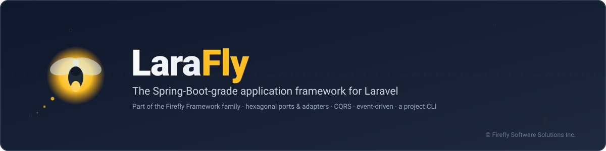

  

  <strong>LaraFly Documentation</strong>

  <em>Everything you need to build production-grade applications with LaraFly — Spring Boot's cohesion, native to Laravel 13.</em>

---

## Getting Started

| Guide | Description |
|-------|-------------|
| [Introduction](index.md) | What LaraFly is, the pitch, and a map of the docs |
| [Installation](installation.md) | Requirements, `composer create-project firefly/skeleton`, and manual install |
| [Getting Started](getting-started.md) | Boot the `firefly/skeleton` template, write your first `#[RestController]`/`#[Service]`, run `firefly:cache` |
| [Architecture](architecture.md) | The hexagonal design, the boot pipeline, and how the Deptrac layers fit together |
| [Tutorial](tutorial.md) | A hand-built, 12-step walkthrough — from `composer create-project` to a `#[Repository]`/`#[Valid]`/CQRS/`#[EventListener]` feature slice |
| [Lumen Sample](../samples/lumen/) | A runnable digital-wallet & ledger sample exercising `#[Transactional]`, CQRS, domain events over EDA, method security, and a REST layer with RFC-7807 problem-details |

---

## Module Guides

Every module guide lives under [`modules/`](modules/), grouped below the same way as the `mkdocs.yml` navigation.

### Foundation

| Guide | Description |
|-------|-------------|
| [Error Handling](modules/error-handling.md) | `firefly/kernel`'s product-agnostic exception hierarchy and HTTP status mapping |
| [Dependency Injection](modules/dependency-injection.md) | `firefly/container` — attributes, component scan → compiled manifest, container resolution |
| [Configuration](modules/configuration.md) | `firefly/config` — profiles, typed config accessor, `#[ConfigProperties]`, `#[Value]` |
| [Application Context](modules/context.md) | `firefly/context` — the `FireflyKernel` boot pipeline, conditions, lifecycle callbacks |
| [Auto-Configuration & Starters](modules/starters.md) | `firefly/autoconfigure` — install a package, get sensible defaults, your own beans win |
| [Validation](modules/validation.md) | `firefly/validation` — the `validate()` primitive and financial-domain rules |

### Web & API

| Guide | Description |
|-------|-------------|
| [Web Layer](modules/web.md) | `firefly/web` — `#[RestController]`/`#[Controller]` routing, parameter binding, JSON + HTML negotiation, RFC-7807 error rendering |
| [Web Filters](modules/web-filters.md) | An ordered `WebFilter` chain bridged onto Laravel's own middleware pipeline |

### Resilience & Scheduling

| Guide | Description |
|-------|-------------|
| [Resilience](modules/resilience.md) | `firefly/resilience` — Retry, CircuitBreaker, RateLimiter, Bulkhead, TimeLimiter, Fallback |
| [Scheduling](modules/scheduling.md) | `firefly/scheduling` — `#[Scheduled]` on Laravel's own scheduler, with distributed-lock guard |

### Data & Domain

| Guide | Description |
|-------|-------------|
| [Domain (DDD)](modules/domain.md) | `firefly/domain` — `Entity`, `ValueObject`, `AggregateRoot`, `DomainEvent`; zero reflection |
| [Data & Repositories](modules/data.md) | `firefly/data` — CRUD/paging ports, derived queries, `#[Query]`, `Specification`s |
| [Relational Data](modules/data-relational.md) | `EloquentRepository` — the Eloquent-backed base every repository extends |
| [Transactions](modules/transactional.md) | `#[Transactional]` — declarative transaction demarcation over manual `DB::beginTransaction()` |

### Eventing & Messaging

| Guide | Description |
|-------|-------------|
| [Event-Driven Architecture](modules/eda.md) | `firefly/eda` — broker-backed `EventPublisher`, envelopes, retry/DLQ, in-memory + queue adapters |
| [EDA Brokers](modules/eda-brokers.md) | Real broker adapters behind the `EventPublisher` port — RabbitMQ, Postgres LISTEN/NOTIFY, Kafka |
| [Messaging](modules/messaging.md) | `firefly/messaging` — the lower-level raw-bytes `MessageBrokerPort`, `#[MessageListener]` |

### CQRS

| Guide | Description |
|-------|-------------|
| [CQRS (Command/Query)](modules/cqrs.md) | `firefly/cqrs` — the CommandBus/QueryBus mediator and the domain→integration-event bridge |

### Security

| Guide | Description |
|-------|-------------|
| [Security](modules/security.md) | `firefly/security` — Spring-Security-6-shaped principal model, authN, deny-by-default authZ |

### Operations

| Guide | Description |
|-------|-------------|
| [Actuator](modules/actuator.md) | `firefly/actuator` — health/info/beans endpoints, the Spring-Boot-Actuator analogue |
| [Observability](modules/observability.md) | `firefly/observability` — the `MeterRegistry`, Prometheus/Micrometer-JSON exposition, CQRS metrics |

### Testing

| Guide | Description |
|-------|-------------|
| [Testing](modules/testing.md) | `firefly/testing` — the boot harness, recording doubles, web/data test-slice builders |
| [Integration Testing](modules/integration-testing.md) | Opt-in tests against real backends (Postgres, Kafka), excluded from the default gate |

### Tooling

| Guide | Description |
|-------|-------------|
| [Installer](modules/installer.md) | `firefly/installer` — the `firefly new` global scaffolding tool, zero runtime dependencies |

---

## Reference

| Document | Description |
|----------|-------------|
| [CLI Reference](cli.md) | `firefly/cli` — `firefly:cache`, `firefly:about`/`:routes`/`:health`/`:metrics`, `make:firefly-*` |
| [Laravel Comparison](laravel-comparison.md) | Side-by-side concept mapping for developers coming from plain Laravel |
| [Versioning](versioning.md) | CalVer (`YY.MM.Patch`), no `version` field, how Packagist derives releases from tags |
| [Contributing](contributing.md) | Monorepo layout, local setup, conventions, how to add a package |
| [Publishing](publishing.md) | The release/split runbook — one CalVer tag, 26 shippable units |

---

## Quick Links

- **New to LaraFly?** Start with [Installation](installation.md), then [Getting Started](getting-started.md).
- **Coming from plain Laravel?** Read the [Laravel Comparison](laravel-comparison.md).
- **Want to see it running end-to-end?** Explore the [Lumen Sample](../samples/lumen/) — a full digital-wallet
  vertical slice.
- **Building a web service?** See the [Web Layer Guide](modules/web.md) and [Web Filters](modules/web-filters.md).
- **Understanding the data layer?** Start with [Data & Repositories](modules/data.md), then
  [Relational Data](modules/data-relational.md) and [Transactions](modules/transactional.md).
- **Need messaging or events?** See [Event-Driven Architecture](modules/eda.md), [EDA Brokers](modules/eda-brokers.md),
  and [Messaging](modules/messaging.md).
- **Writing commands/queries?** See [CQRS](modules/cqrs.md).
- **Securing an app?** See [Security](modules/security.md).
- **Shipping to production?** See [Actuator](modules/actuator.md), [Observability](modules/observability.md),
  and [Resilience](modules/resilience.md).
- **Writing tests?** See [Testing](modules/testing.md) and [Integration Testing](modules/integration-testing.md).
- **Releasing a version?** See [Versioning](versioning.md) and [Publishing](publishing.md), and check the
  [`CHANGELOG.md`](../CHANGELOG.md) at the repo root.
- **Want to contribute?** See [Contributing](contributing.md).

---

*The guided, book-style [*LaraFly by Example*](../book/README.md) book — 13 chapters plus appendices,
bilingual (English + Spanish), rendered to PDF + EPUB — is available now, alongside the step-by-step
[Tutorial](tutorial.md).*

Apache-2.0 © Firefly Software Solutions Inc.
