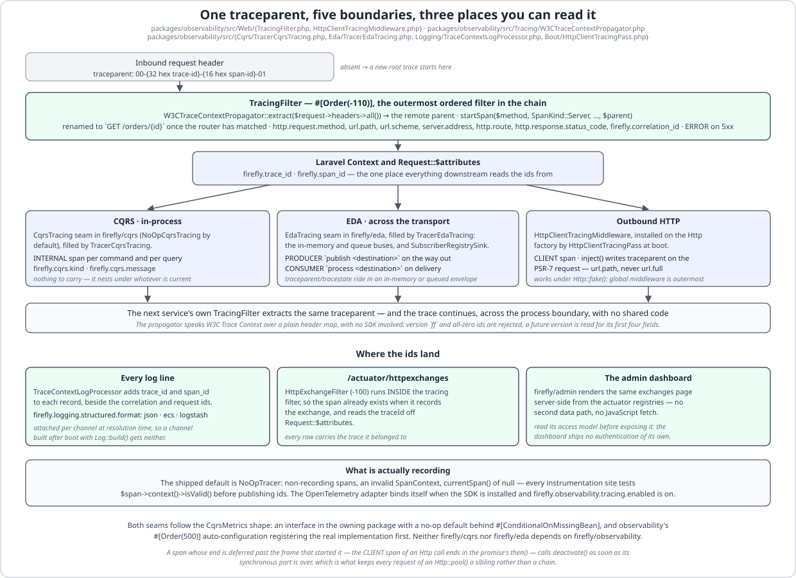

# Architecture

LaraFly is **hexagonal**: every subsystem exposes a nominal PHP interface (a *port*) and one or more
*adapters*. Domain and application code depend only on ports. Architectural direction is enforced with
**Deptrac**.

Everything below is a description of code in this repository, and every class, attribute, order value and
configuration key named here is checked by a test — `tests/DocsCodeIsRealTest.php` holds every listing on this
page to the file it claims to come from, and `tests/DocsDiagramsTest.php` holds the diagrams to the
attributes they draw.

## The boot pipeline

Every capability package plugs into one shared `FireflyKernel` through `FireflyServiceProvider`: a
provider's `register()` only *buffers* its `BootPass` contributions (into `PendingBootPasses`) — it never
resolves the kernel itself, so Laravel's alphabetical package-discovery order can never affect boot order.
The kernel drains that buffer and decides the real order, phase by phase:


The phases are the contract. A component scan discovers stereotyped classes; auto-configuration candidates
are *discovered* at phase 200 and *committed* at phase 500, tagged `DefinitionSource::AutoConfiguration`; a
`#[ConditionalOnMissingBean(X)]`-guarded `#[Bean]` survives *back-off* at phase 600 only if nothing else
already registered an `X`; and the wiring passes at phase 1000 turn the compiled manifests into real Laravel
routes, middleware, listeners and scheduled tasks. Because back-off happens after every definition is on the
table, your own bean wins regardless of which provider Laravel instantiated first.

## The kernel layer

`firefly/kernel` is the zero-dependency foundation:

- **`Firefly\Kernel\Lifecycle`** — the `start()`/`stop()` contract for infrastructure adapters.
- **`Firefly\Kernel\Exception\*`** — a product-agnostic typed exception taxonomy.
- **`Firefly\Kernel\Error\*`** — the RFC-7807 `ErrorResponse` model.
- **`Firefly\Kernel\Exception\Infrastructure\*`** — the `DataAccessException` family, Spring's ported into PHP. This
  is what `firefly/data`'s `PersistenceExceptionTranslator` throws. It reads the driver's own error code first and
  the SQLSTATE second — `DriverErrorTable` holds both tables, because the same SQLSTATE hides different failures
  — and produces exactly eight kinds: `DuplicateKeyException`, `DataIntegrityViolationException`,
  `DeadlockLoserDataAccessException`, `CannotAcquireLockException`, `QueryTimeoutException`,
  `TransientDataAccessResourceException`, `DataAccessResourceFailureException` and `BadSqlGrammarException`, with a
  generic `DataAccessException` for a code neither table classifies. It is applied at three seams and nowhere else
  — every `EloquentRepository` method, `TransactionTemplate::execute()`, and every `#[Transactional]` proxy, which
  delegates to that template — so a raw `DB::` call outside all three still throws Laravel's `QueryException`
  exactly as before, and `firefly.data.exception-translation.enabled` turns the translation off wholesale.
  Two members of the family never come from a driver code at all: `firefly/data` raises `OptimisticLockException`
  (a subclass of `OptimisticLockingFailureException`) from the `HasOptimisticLock` version check when the guarded
  `UPDATE` matches zero rows, and `EmptyResultDataAccessException` from `getById()`, the `orElseThrow`-shaped
  finder. Each member carries the HTTP status its failure implies — a duplicate key is the client's 409, an
  unreachable database the platform's 503, a missing row its 404 — so `problem+json` needs no per-controller
  mapping. The translated message is a *fixed sentence*; the driver's own text, which has the statement and its
  bindings interpolated into it, stays on `previous` for the log and never reaches the wire.
- **`Firefly\Kernel\Version`** — the CalVer constant every other package agrees with.
  `tests/VersionConsistencyTest.php` checks it against the CHANGELOG's latest heading and the README's
  version badge, so the three cannot drift apart.

Its `composer.json` requires nothing but `php: ^8.3`, and no file under `packages/kernel/src` imports
`Illuminate\*` or `Symfony\*`. That is what makes it safe for a domain package to reuse the exception
taxonomy without acquiring a framework dependency — and it is the reason `deptrac.yaml` can write the
`Kernel` layer's rule as `~`.

## Ports and adapters, enforced

The rule that domain code depends only on ports is not a convention here; it is a build step.
`deptrac.yaml` declares **one layer per package** — 28 of them, each collecting `packages/<name>/src/.*` —
and then a `ruleset` that gives, for every layer, the *complete* list of layers it is allowed to reference.
Anything not on that list is a violation, and `composer check` runs `deptrac analyse` as its fourth step, so
a `use` statement pointing the wrong way fails the gate rather than a review.

<!-- source: deptrac.yaml -->

```yaml
- name: Domain
  collectors:
    - type: directory
      value: packages/domain/src/.*
# …
Domain:
  - Kernel
# …
Data:
  - Kernel
  - Container
  - Config
  - Context
  - AutoConfigure
  - Domain
```

Read those two rules together and the direction is unambiguous: `Data` may see `Domain`, and `Domain` may
see nothing but `Kernel`. There is no entry anywhere in the ruleset that lets an aggregate reach for a
repository adapter, an Eloquent model or an HTTP request. Read the ruleset the other way and the leaves fall
out too: `Admin`, `OpenApi`, `Cli`, `Testing`, `Installer` and the three broker adapters (`EdaRabbitmq`,
`EdaPostgres`, `EdaKafka`) appear in no other layer's list at all, so nothing in the framework depends on
them and each can be added or dropped without touching the rest. Two layers have `~` for a rule — `Kernel`
and `Installer` — which is Deptrac for "may depend on no layer whatsoever": the first is what makes the
kernel's exception taxonomy safe for anyone to reuse, and the second is what keeps a global `firefly new`
install from dragging the runtime family onto a developer's machine.

The comments in `deptrac.yaml` are part of the design record: each ruleset entry says in prose *why* each
edge exists, so adding one is a decision somebody has to write down.


## The request path

A request enters through Laravel's own HTTP kernel. `FilterChainRegistrar` is a `BootPass` that collects
every `WebFilter` bean, sorts it, and **pushes the ordered list onto Laravel's global middleware stack** — so
a LaraFly filter runs in the same pipeline as CORS or secure-headers middleware, not in a parallel one:

<!-- source: packages/web/src/Filter/FilterChainRegistrar.php -->

```php
public function orderedFilters(BootContext $context): array
{
    $beans = [];
    foreach ($context->definitions->all() as $definition) {
        if (is_a($definition->class(), WebFilter::class, true)) {
            $beans[] = ['class' => $definition->class(), 'order' => $definition->descriptor->order];
        }
    }

    usort($beans, static function (array $a, array $b): int {
        return $a['order'] <=> $b['order'] ?: strcmp($a['class'], $b['class']);
    });

    return array_merge(
        [RequestContextFilter::class, CorrelationIdFilter::class],
        array_map(static fn (array $bean): string => $bean['class'], $beans),
    );
}
```

Two things in that method matter more than they look. The order comes from `$definition->descriptor->order`
— the **manifest's** number, read without resolving the bean — which is what keeps the chain reflection-free
on a cached boot. And ties break with `strcmp` on the class name, which is why two filters sharing an order
still have one fixed, reproducible sequence.

Past the filters, routing is a compiled artefact. `RouteScanner` reads `#[RestController]`/`#[Controller]`
classes and their verb attributes once, at cache time, into a `RouteManifest` of `RouteDescriptor`s;
`RouteWiringPass` then registers **a native Laravel route per descriptor** at the wiring phase, so
`route:list`, URL generation and route caching all keep working. Each route's action is a closure built by
`ControllerDispatcher`, which per request resolves the controller bean, binds arguments, checks
dispatch-time method security, invokes the handler and content-negotiates the return value.

Argument binding is `ArgumentResolver` working from the descriptor's compiled binding plan — a pure array,
never reflection — hydrating `#[PathVariable]`, `#[QueryParam]`, `#[RequestHeader]` and `#[RequestBody]`
parameters, validating a `#[Valid]` body through `BeanValidator` *before* the DTO is constructed, and
raising `InvalidRequestException` (400) for a missing or uncoercible input. Before it consults any of its
own kinds it asks the registered `HandlerMethodArgumentResolver` beans — the extension point Spring gives
the same name — so a class-typed parameter another package understands never reaches the container.
`firefly/security` registers exactly one, for `SecurityContext`, `Authentication`, `UserDetails`,
`#[AuthenticationPrincipal]` and `#[CurrentSecurityContext]` — and it answers a 401, never a `TypeError`,
when a non-nullable principal parameter has nobody to bind.

A throw is not caught and reshaped locally. `ControllerDispatcher` offers it to the
`ExceptionHandlerRegistry` (a controller-local `#[ExceptionHandler]` beats a global `#[ControllerAdvice]`),
and with no match it propagates to Laravel's exception handler, where the RFC-7807 renderable turns it into
`application/problem+json` — or, for a browser, into the framework's error page. A 404, a 422 and a denied
`#[PreAuthorize]` therefore all travel the real HTTP pipeline.


## Interception: one proxy, many advices

`#[Transactional]` and `#[PreAuthorize]` do not each own an interception mechanism. There is one, and it is
a port: `AdviceSource` in `firefly/data`, with three methods — `advice()`, `scan($psr4)` and `render($row)`.
A package contributes a kind of advice by shipping one `#[Component]` that implements it. `firefly/data`
ships `TransactionalAdviceSource`; `firefly/security` ships `MethodSecurityAdviceSource`; the port is open
for a third.

`ProxyPlanner` merges every source's `scan()` rows into a single `ProxyPlan` — class → method → the ordered
`(advice id, descriptor row)` pairs — and `ProxyPlanCompiler` `var_export`s that plan into `proxy-plan.php`,
a literal the cached boot `require`s without reflecting. `ProxyClassGenerator` then writes **one class per
bean**, `final class Foo__FireflyTransactionalProxy extends Foo`, carrying one `MethodInterceptor` property
and one static descriptor factory *per advice kind the class actually uses* — `__fireflySecurityInterceptor`
and `__fireflyTxInterceptor`, `__fireflySecurityDescriptor()` and `__fireflyTxDescriptor()` — with the
descriptors baked in as literals so nothing is looked up at run time.

At run time the container hands out the proxy, and `MethodInvocation::proceed()` walks the interceptor list
to a terminal closure that calls `parent::`. The ordering rule is the whole point: **lower advice order runs
outer**. Security's advice is order 100, the transaction's is 1000, so `MethodSecurityInterceptor` evaluates
`#[PreAuthorize]` and `#[PreFilter]` *before* `TransactionInterceptor` opens anything — a refusal never
opens a transaction — and on the way back out the transaction commits or rolls back first, then
`#[PostAuthorize]` and `#[PostFilter]` are applied to the returned value. An advice whose interceptor bean is
absent fails the boot with a `ConfigurationException` unless it declared `inertWhenUnbound: true`, which
method security does, because "the attributes are inert until `firefly.security.enabled` is on" is its
documented state; `InterceptorRegistry` then hands the proxy a `PassThroughInterceptor` instead.


## Security

`firefly/security` is deny-by-default and filter-shaped, the same two properties Spring Security has.
`HttpSecurityFilter` at `#[Order(-70)]` evaluates an ordered URL rule list, first match wins, and denies
anything unmatched. Everything that could have authenticated the request has already run by then:
`SecurityContextPersistenceFilter` (`-94`) loads the context from the session and saves it afterwards, and
`firefly/security`'s own five authentication mechanisms — `FormLoginFilter` (`-92`),
`HttpBasicFilter` (`-91`), `JwtAuthenticationFilter` (`-90`), `OAuth2ResourceServerFilter` (`-85`) and
`RememberMeAuthenticationFilter` (`-83`) — each write into the same `SecurityContext`.

When `HttpSecurityFilter` denies an **anonymous** request it does not simply throw. It calls the
`AuthenticationEntryPoint`, and the shipped `DelegatingAuthenticationEntryPoint` chooses between four modes
under `firefly.security.http.entry_point`:

- **`auto`** (the default) — a *browser* is sent to the login page when form login or OAuth2 login is on;
  otherwise, when HTTP Basic is on, it gets a `WWW-Authenticate: Basic` challenge; otherwise the 401. The
  browser test is `ErrorPageRenderer::prefersHtml()`: the request names `text/html` (or
  `application/xhtml+xml`), is neither an `XMLHttpRequest` nor a `wantsJson()` call, and its path is not
  under `firefly.web.error-page.json-paths`. That last clause is the one that is easy to drop and must not
  be — Laravel's `wantsJson()` looks only at the *first* acceptable type, so a client that copies a browser's
  `Accept: text/html, application/json` is not a `wantsJson()` call at all and does name `text/html`, yet is
  plainly a machine asking; `json-paths` is the one clause that says the URL itself is an API surface.
- **`login`** — always the login page, and the boot is refused when neither login mechanism is enabled.
- **`challenge`** — always the Basic challenge.
- **`problem`** — always the exception, rendered by `firefly/web`.

`HttpBasicFilter` answers with its own `BasicAuthenticationEntryPoint` rather than this one, because a caller
that presented Basic credentials has already chosen its mechanism.

Method security is not a controller feature. `#[PreAuthorize]`, `#[PostAuthorize]`, `#[PreFilter]`,
`#[PostFilter]`, `#[Secured]` and `#[RolesAllowed]` are enforced through the shared interceptor chain above, so
they hold on **any stereotyped bean** — a `#[Service]`, a `#[CommandHandler]`, a `#[Repository]` — wherever
it is called from, and additionally at the controller dispatcher through `MethodSecurityControllerGuard`.
The expression evaluator is a closed, no-`eval` whitelist tokenizer: `hasRole`, `hasAnyRole`, `hasAuthority`,
`hasAnyAuthority`, `hasScope`, `hasAnyScope`, `hasPermission`, `isAuthenticated`, `permitAll`, `denyAll` and
`#param` references, and nothing else.

Both halves of OAuth2 are **separate installs** that light up more filters in the same chain.
`firefly/security-oauth2-client` adds `OAuth2AuthorizationRequestRedirectFilter` (`-89`) and
`OAuth2LoginAuthenticationFilter` (`-88`) for signing in with a provider;
`firefly/security-oauth2-server` adds `OAuth2AuthorizationServerFilter` (`-82`) for *being* one. Neither is
required by `firefly/security`, and `firefly/security` depends on neither — they see it only through ports
it already owns.


## Observability

Tracing is a port, not a vendor. `Firefly\Observability\Tracing\Tracer` has three methods — `startSpan()`,
`currentSpan()` and `trace()` — and the **shipped default is `NoOpTracer`**: its spans record nothing, its
`SpanContext` is invalid, and every instrumentation site in the framework checks
`$span->context()->isValid()` before publishing an id. The OpenTelemetry adapter binds itself in front of
that default only when the SDK is installed and `firefly.observability.tracing.enabled` is on, and
`firefly/testing` supplies an in-memory `RecordingTracer` for assertions.

`W3CTraceContextPropagator` speaks [W3C Trace Context](https://www.w3.org/TR/trace-context/) over a plain
header map, with no SDK involved. `TracingFilter`, the outermost ordered filter at `#[Order(-110)]`, calls
`extract()` on the inbound headers and starts a `SERVER` span with whatever came back as its parent — so a
request arriving with a `traceparent` continues that trace and one arriving without starts a new root — then
publishes `firefly.trace_id` and `firefly.span_id` onto Laravel's `Context` and `Request::$attributes`. From
there the same trace crosses five boundaries: inbound HTTP, an `INTERNAL` span per CQRS message, a
`PRODUCER` span stamping `traceparent` into the envelope's headers on the in-memory and queue buses, a
`CONSUMER` span on every delivery — a broker's included, through the shared `SubscriberRegistrySink` — and a
`CLIENT` span on every outbound `Http` call, which injects the header again for the next service's own filter
to extract. The producer half is the narrower one on purpose: `eda-rabbitmq`, `eda-kafka` and `eda-postgres`
build their envelopes themselves and do not reach the publish seam yet, so a `traceparent` reaches a broker
only when something upstream put it there — see [Known-latent](modules/tracing.md#known-latent).

The CQRS and EDA seams follow the `CqrsMetrics` shape: an interface in the owning package with a no-op
default behind `#[ConditionalOnMissingBean]`, and observability's `#[Order(500)]` auto-configuration
registering the real implementation first. Neither `firefly/cqrs` nor `firefly/eda` depends on
`firefly/observability`.

Structured logging carries the same identifiers. `TraceContextLogProcessor` stamps `trace_id` and `span_id`
onto every record beside the correlation and request ids, and `firefly.logging.structured.format` —
`json`, `ecs` or `logstash`, or empty for plain text — decides how a line is rendered, attached per channel
at resolution time.

Metrics and introspection are the actuator's. Fifteen `ActuatorEndpoint` implementations ship, discovered
into the `ActuatorRegistry` — health, info, env, beans, conditions, mappings, loggers, scheduledtasks, caches,
configprops, metrics, prometheus, process, httpexchanges, and oauth2clients when the authorization server is
installed — and the sensitive ones answer **404** until named in
`firefly.management.endpoints.web.exposure.include`. `firefly/admin` renders those same beans server-side by
resolving them **in-process from that registry**, never by fetching its own HTTP surface: one data path, and
pages the JSON surface deliberately keeps unexposed. That is also why the dashboard's own URL is its entire
security boundary — read [its access model](modules/admin.md#access-the-whole-security-boundary) before
enabling it with `app.debug` off.



## Async → sync (preview)

PyFly (the Python edition) is async-first. LaraFly targets Laravel's synchronous, share-nothing request
lifecycle by default, with Laravel queues/Horizon for async work and optional Octane (Swoole/RoadRunner)
for long-running/WebSocket/SSE workloads. This section is expanded as those subsystems land.
